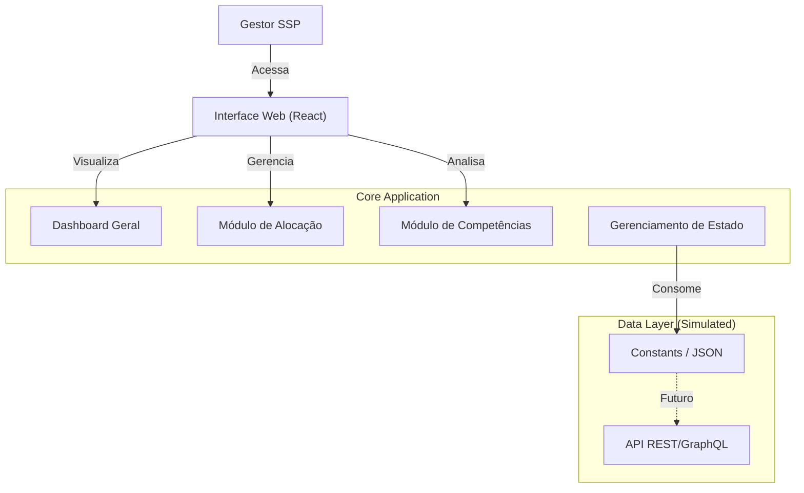

# Documentação do Projeto - Método BMAD

Este documento segue a estrutura da metodologia **BMAD (Breakthrough Method for Agile AI-Driven Development)**, consolidando os requisitos e a arquitetura do projeto **SSP-DF Strategic Dashboard**.

> **Nota:** Esta documentação foi gerada através de engenharia reversa do código existente em `01/01/2026`, simulando os artefatos que seriam produzidos pelos agentes de IA do método BMAD (Product Owner e Architect) no início do projeto.

---

## 1. Product Requirements Document (PRD)

### 1.1 Visão do Produto
O **SSP-DF Strategic Dashboard** é uma plataforma centralizada de inteligência de dados destinada à Secretaria de Segurança Pública do Distrito Federal. Seu objetivo é apoiar a tomada de decisão estratégica através do monitoramento em tempo real de efetivo, alocação de recursos, gaps de competências e projeções de vacância das forças de segurança (PMDF, PCDF, CBMDF, DETRAN-DF).

### 1.2 Personas
*   **Gestor Estratégico (SSP):** Administrador com visão holística, focado em otimização de recursos e planejamento de longo prazo. Precisa de dados consolidados e confiáveis.

### 1.3 Objetivos de Negócio
1.  **Visibilidade Unificada:** Integrar dados de múltiplas forças e sistemas (SIGRH, Sinesp, Portais de Transparência) em uma única visão.
2.  **Planejamento Preditivo:** Antecipar aposentadorias e vacâncias para planejar concursos e alocações.
3.  **Otimização de Competências:** Identificar carência de habilidades críticas (ex: Crimes Cibernéticos) para direcionar capacitação.

### 1.4 User Stories (Épicos Principais)

#### Épico 1: Monitoramento Estratégico (Dashboard Overview)
*   **US-1.1:** Como Gestor, quero visualizar KPIs de "Efetivo Total", "Cobertura Regional" e "Índice de Especialização" para ter um pulso imediato da segurança.
*   **US-1.2:** Como Gestor, quero ver um gráfico de projeção de aposentadorias para os próximos anos para antecipar crises de efetivo.
*   **US-1.3:** Como Gestor, quero acompanhar o status de sincronização das fontes de dados (ETL) para confiar na informação apresentada.

#### Épico 2: Alocação Estratégica (Módulo Allocation)
*   **US-2.1:** Como Gestor, quero visualizar o efetivo Real vs. Ideal por Região Administrativa para identificar áreas desguarnecidas.
*   **US-2.2:** Como Gestor, quero dados sobre crimes violentos (CVLI) correlacionados com o efetivo para justificar realocações.

#### Épico 3: Gestão de Competências (Módulo Competencies)
*   **US-3.1:** Como Gestor, quero ver o gap entre habilidades necessárias e disponíveis (ex: Investigação, Patrulhamento) para criar planos de curso.

#### Épico 4: Administração e Suporte
*   **US-4.1:** Como Gestor, quero realizar buscas por servidores ou unidades específicas.
*   **US-4.2:** Como usuário, quero acessar documentação de ajuda e suporte.

---

## 2. Application Architecture Document (AAD)

### 2.1 Visão Geral da Arquitetura



O sistema é construído como uma **Single Page Application (SPA)** moderna, focada em performance e experiência do usuário ágil. Atualmente opera em modo *client-side* com dados mockados para prototipação de alta fidelidade, preparada para integração futura com APIs REST/GraphQL.

### 2.2 Tech Stack
*   **Runtime/Build:** Node.js, Vite (para build ultra-rápido e HMR).
*   **Linguagem:** TypeScript (Tipagem estática estrita para robustez).
*   **Framework Frontend:** React 18 (Functional Components, Hooks).
*   **Estilização:** Tailwind CSS (Utility-first para design system consistente).
*   **Visualização de Dados:** Recharts (Gráficos compostos e responsivos).
*   **Ícones:** Lucide React.
*   **Roteamento:** Gerenciamento de estado interno (simulado) para navegação instantânea sem reload.

### 2.3 Estrutura de Diretórios (File Structure)
```
/
├── components/         # Componentes de UI Reutilizáveis (Dumb Components)
│   ├── KPICard.tsx     # Card padrão para indicadores métricos
│   └── Sidebar.tsx     # Navegação principal e estrutura de layout
├── pages/              # Componentes de Página (Smart Components/Views)
│   ├── DashboardOverview.tsx # Visão principal com gráficos e KPIs
│   ├── Allocation.tsx        # Tabelas e mapas de alocação
│   └── ...                   # Outros módulos (Competencies, Reports, etc.)
├── constants.ts        # Mock Data e Configurações Estáticas
├── types.ts            # Definições de Tipos TypeScript (Interfaces de Domínio)
└── App.tsx             # Entry point, Layout Shell e Roteador Lógico
```

### 2.4 Modelo de Dados (Domain Model)
Baseado em `types.ts`, o domínio é estruturado em:
*   **ForceType:** Enumeração das forças (PMDF, PCDF, etc.).
*   **RegionData:** Agregação de dados geoespaciais (Efetivo Real/Ideal, Criminalidade).
*   **CompetencyGap:** Métricas de RH para skills.
*   **RetirementData:** Séries temporais para projeções.

### 2.5 Padrões de Design Adotados
*   **Componentização Atomica:** Pequenos componentes focados (ex: `KPICard`).
*   **Mock-First Development:** Interface completa desenvolvida com dados estáticos (`constants.ts`) permitindo validação de UX antes do backend.
*   **Responsive Design:** Layout adaptável (Sidebar fixa, Grid system responsivo) via Tailwind.

---

## 3. Backlog e Próximos Passos (Roadmap Técnica)

Com base no estado atual do código, as seguintes tarefas seriam priorizadas pelo Agente Scrum Master:

1.  **Integração de Backend:** Substituir `constants.ts` por chamadas `fetch/axios` para uma API real.
2.  **Autenticação:** Implementar contexto de segurança real (OAuth/JWT) substituindo o estado `inSystem`.
3.  **Refinamento de Módulos:** Completar a implementação das páginas "Registration" e "Reports" (atualmente placeholders).
4.  **Testes:** Implementar testes unitários (Jest/Vitest) para regras de cálculo de KPIs.

---
*Gerado automaticamente pelo Agente de Documentação BMAD em 01/01/2026.*
