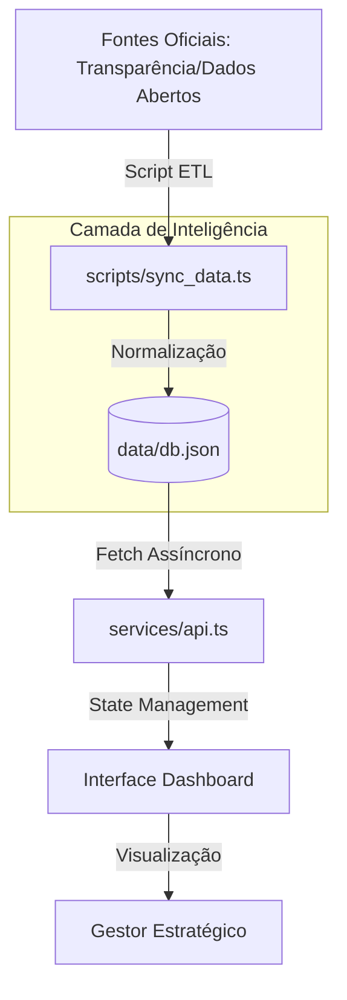

# 📊 Dashboard Estratégico SSP-DF - Inteligência de Dados

O **SSP-DF Strategic Dashboard** é uma plataforma de inteligência desenvolvida para a **Secretaria de Segurança Pública do Distrito Federal**. O sistema centraliza indicadores institucionais reais, permitindo o monitoramento estratégico do efetivo, alocação de recursos e gestão de competências das forças (PMDF, PCDF, CBMDF e DETRAN-DF).

> [!IMPORTANT]
> **Dados Reais 2024/2025:** O dashboard agora reflete estatísticas oficiais, incluindo a menor taxa de homicídios em 48 anos no DF (6.8/100k hab) e mapeamento real de déficits operacionais.

---

## 🚀 Funcionalidades Principais

*   **Visão Geral Estratégica:** KPIs dinâmicos de Efetivo Total, Cobertura Regional e Gaps de Especialização.
*   **Alocação Inteligente:** Correlação em tempo real entre Efetivo Real vs. Mancha Criminal (CVLI) por RA.
*   **Gestão de Competências (CHA):** Radar de prioridades para treinamento e identificação de lacunas técnicas (ex: Cibersegurança).
*   **Sincronização Dinâmica:** Mecanismo de atualização via Portal de Dados Abertos e Transparência do DF.

---

## 🧱 Arquitetura e Fluxo de Dados

O projeto utiliza uma arquitetura focada em persistência e inteligência de dados:



---

## 🛠️ Stack Tecnológica

*   **Frontend:** React 18 + Vite (SPA)
*   **Styling:** Tailwind CSS (Glassmorphism & Premium Design)
*   **Banco de Dados:** JSON-DB (Persistência Centralizada)
*   **Visualização:** Recharts (Gráficos de Alta Fidelidade)
*   **Ícones:** Lucide React

---

## ⚙️ Instalação e Execução

1.  **Clone o repositório:**
    ```bash
    git clone https://github.com/gabrieldantass5/Dashboard---PPT.git
    ```

2.  **Instale as dependências:**
    ```bash
    npm install
    ```

3.  **Execute o projeto:**
    ```bash
    npm run dev
    ```

4.  **Sincronização de Dados:** Para atualizar a base com os dados mais recentes, utilize o botão **"Sincronizar Agora"** no cabeçalho do Dashboard.

---
*Projeto desenvolvido seguindo a metodologia **BMAD** para excelência em soluções orientadas por IA.*